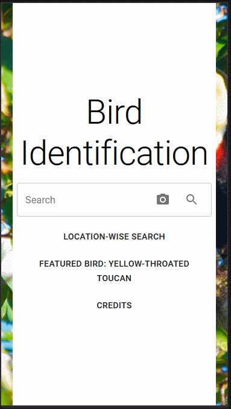

# bird-identification

Bird Identification PWA made with ReactJS. The intended aim of this app is to identify bird species on the basis of an input image.



To check out the project...

> Clone / Download zip

> run "npm install" (will require node and npm)

> add [IUCN Token](https://apiv3.iucnredlist.org/api/v3/token) in src/IUCNToken.js

```js script
const IUCNToken = "...";
export default IUCNToken;
```

> run "npm start"

Feedback is appreciated. Thank you!
